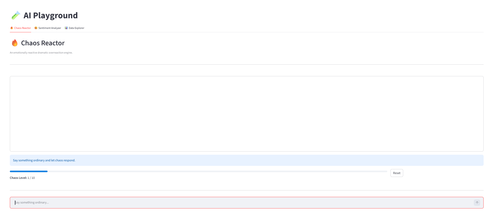
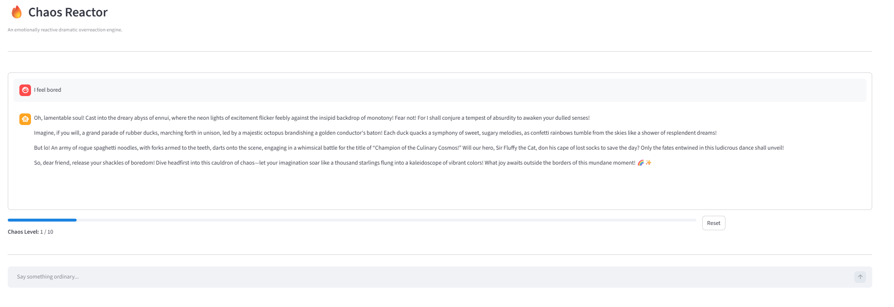

# 🧪 AI Playground

A multi-tab Streamlit application demonstrating hybrid AI system design combining:

- Classical NLP (VADER Sentiment Analysis)
- LLM-based text generation (OpenAI)
- Stateful reactive behavior modeling
- Modular architecture
- Interactive UI

Live Demo:
https://ai-playground-nobodiez.streamlit.app/

---

## 🔥 Tab 1 — Chaos Reactor

An emotionally reactive dramatic overreaction engine.

### How It Works

1. User input is analyzed using VADER sentiment analysis.
2. Sentiment score dynamically adjusts a "Chaos Level" (1–10).
3. The LLM is conditioned with:
   - Current chaos intensity
   - Detected emotional tone
4. A theatrical, exaggerated response is generated.

### Architecture

User Input  
→ Sentiment Analyzer (VADER)  
→ Rule-based Chaos Adjustment  
→ LLM Generation  
→ Stateful UI Update  

This demonstrates:
- Hybrid ML + LLM orchestration
- Stateful reactive design
- Controlled prompt conditioning
- Modular separation of concerns

---

## 😊 Tab 2 — Sentiment Analyzer

Standalone sentiment analysis interface using VADER.

Features:
- Real-time sentiment classification
- Confidence scoring
- Deterministic local processing (no API calls)

---

## 📊 Tab 3 — Data Explorer

Upload a CSV file and:
- Inspect dataset structure
- View summary statistics
- Generate basic visualizations

Demonstrates:
- File handling in Streamlit
- Data visualization
- Interactive UI controls

---

## 🏗 Project Structure

```text

ai_playground/
│
├── app.py
├── requirements.txt
│
└── utils/
├── chaos.py
└── sentiment.py
```

---

## ⚙️ Technologies Used

- Python
- Streamlit
- OpenAI API
- VADER Sentiment
- Pandas
- Matplotlib

---

## 🧠 Design Philosophy

This project intentionally separates:

- UI Layer (`app.py`)
- Sentiment Logic (`sentiment.py`)
- LLM Generation (`chaos.py`)

The system follows a reactive pipeline model rather than an autonomous agent design, prioritizing determinism and explainability.

---

## 🚀 Future Improvements

- Chaos decay mechanism
- Emotion-aware response styles
- Conversation memory summarization
- Enhanced visualization in Data Explorer
- User session persistence

---

## 👤 Author

Built as part of hands-on experimentation with Streamlit and applied AI system design.

## 🔥 Chaos Reactor Preview



